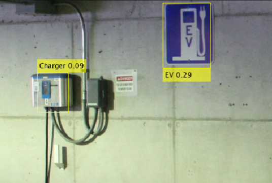

# YOLOv4-Parking-Signs-Detector

\
*Example of YOLOv4 Model successfully detecting parking signs from test dataset*

## Overview

In this project, I use a YOLOv4 model with 2 detection heads (tiny-yolo) and 20 anchor boxes to detect 3 types of parking signs/classes: EV, Accessible, and Charger. The labeled dataset has been obtained from MathWorks.

## Required Files

The codebase consists of 3 files: 
1. AnalyzingLabeledData.mlx
2. ModelTraining.mlx
3. ModelEvaluation.mlx

## How the Code Works

In AnalyzingLabeledData.mlx, I perform analysis on the dataset by analyzing the area and aspect ratio of the bounding boxes, creating box plots of both classes and investigating any outliers, using helper functions.

In ModelTraining.mlx, I create datastores of the train data, estimate the number of anchor boxes (since YOLOv4 requires them), and perform test-train split on the dataset (80-20 split). After analysis of the anchor boxes vs Mean IoU plot, 20 anchor boxes are chosen for the model and the model is trained with Learning Rate = 0.001 and Max Epochs = 50, among other hyperparameters. 

In ModelEvaluation.mlx, I create datastores of the test data, initially run the detector with a low confidence threshold on the images, plot precision-recall curves of the results and plot a confusion matrix. After doing that, I find a global confidence threshold and plot a Mean Average Precision (mAP) vs Detection Threshold graph.

## Acknowledgments

This project was a part of the MathWorks Deep Learning for Object Detection course and the dataset has also been provided by MathWorks. The MATLAB Computer Vision Toolbox and the Deep Learning Toolbox was used to implement the YOLOv4 Model.
